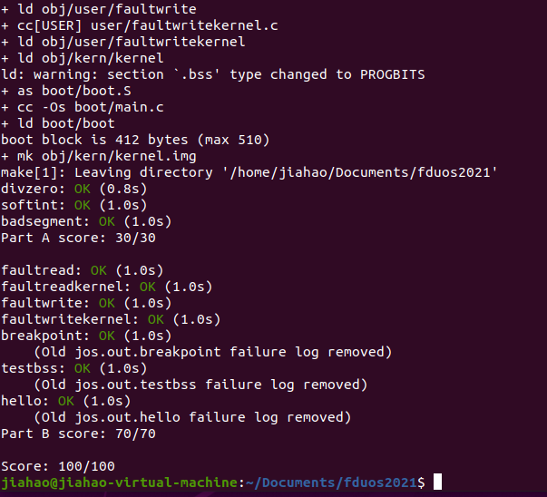

## exercise 2

env_init()：初始化envs数组，构建env_free_list链表,节点数为NENV，注意envs[0]在头部

```c
void
env_init(void)
{
	// Set up envs array
	// LAB 3: Your code here.

	env_free_list = NULL;
	for (int i = NENV - 1; i >= 0; i--) {	//链表前插法构建
		envs[i].env_id = 0;
		envs[i].env_link = env_free_list;
		env_free_list = &envs[i];
	}
	//panic("env_init not yet implemented");
	// Per-CPU part of the initialization
	env_init_percpu();
}
```


env_setup_vm(struct Env *e): 传入ENV结构指针e， 为进程分配内存空间，设置e->env_pgdir字段


region_alloc(struct Env *e, void *va, size_t len)：为e 分配len byte大小的物理空间，并将va虚拟地址开始的len长度大小的空间映射到该物理空间。操作e->env_pgdir


load_icode(struct Env *e, uint8_t *binary)：为e加载binary地址开始处的ELF文件。


env_create(uint8_t *binary, enum EnvType type)：从env_free_list链表选取一个Env结构，加载从binary地址开始的ELF文件，用户环境类型为 type。

```c
void
env_create(uint8_t *binary, enum EnvType type)
{
	// LAB 3: Your code here.
	struct Env *e;
	int r;
	if ((r=env_alloc(&e,0)!=0)){		//创建新的env变量，若失败则报告错误信息
		panic("create env failed\n");
	}
	load_icode(e,binary);	//加载ELF文件
	e->env_type = type;		//设置env_type
	//panic("env_create not yet implemented");
}	
```


env_run(struct Env *e)：执行e指向的用户环境

```c
// LAB 3: Your code here.
	if (curenv && curenv->env_status == ENV_RUNNING) {	//首先设置curenv
		curenv->env_status = ENV_RUNNABLE;
	}
	curenv = e;
	e->env_status = ENV_RUNNING;
	e->env_runs++;
	lcr3(PADDR(e->env_pgdir));		//加载地址空间
	env_pop_tf(&e->env_tf);       	//弹出env_tf结构到寄存器

	//panic("env_run not yet implemented");
}
```


## exercise 4

参考信息：

 


代码：

定义每个中断类型的中断处理函数

TRAPHANDLER_NOEC表示不压入错误信息，TRAPHANDLER表示需要错误信息

每个都压入中断号，再 jmp _alltraps

_alltraps的作用是把中断现场的上下文保存到内核栈中，然后jmp到trap函数，做真正的中断处理

```
/*
 * Lab 3: Your code here for generating entry points for the different traps.
 */
TRAPHANDLER_NOEC(th0, T_DIVIDE)
TRAPHANDLER_NOEC(th1, T_DEBUG)
TRAPHANDLER_NOEC(th2, T_NMI)
TRAPHANDLER_NOEC(th3, T_BRKPT)
TRAPHANDLER_NOEC(th4, T_OFLOW)
TRAPHANDLER_NOEC(th5, T_BOUND)
TRAPHANDLER_NOEC(th6, T_ILLOP)
TRAPHANDLER_NOEC(th7, T_DEVICE)
TRAPHANDLER(th8, T_DBLFLT)

TRAPHANDLER(th10, T_TSS)
TRAPHANDLER(th11, T_SEGNP)
TRAPHANDLER(th12, T_STACK)
TRAPHANDLER(th13, T_GPFLT)
TRAPHANDLER(th14, T_PGFLT)

TRAPHANDLER_NOEC(th16, T_FPERR)
TRAPHANDLER(th17, T_ALIGN)
TRAPHANDLER_NOEC(th18, T_MCHK)
TRAPHANDLER_NOEC(th19, T_SIMDERR)
TRAPHANDLER_NOEC(th48, T_SYSCALL)
TRAPHANDLER_NOEC(th_default, T_DEFAULT)


/*
 * Lab 3: Your code here for _alltraps
 */
.global _alltraps
_alltraps:
	# according to struct Trapframe, we need to push %ds and %es
	pushl %ds
	pushl %es
	pushal
	movw $GD_KD, %ax
	movw %ax, %ds
	movw %ax, %es
	pushl %esp 
	call trap
```


补充trap_init():

```c
void
trap_init(void)
{
	extern struct Segdesc gdt[];


	// LAB 3: Your code here.
	void th0();
	void th1();
	void th2();
	void th3();
	void th4();
	void th5();
	void th6();
	void th7();
	void th8();

	void th10();
	void th11();
	void th12();
	void th13();
	void th14();

	void th16();
	void th17();
	void th18();
	void th19();
	void th48();
	void th_default();
	SETGATE(idt[0], 0, GD_KT, th0, 0);		//SETGATE(gate, istrap, sel, off, dpl)，定义在inc/mmu.h中
	SETGATE(idt[1], 0, GD_KT, th1, 0);  	//设置idt[1]，段选择子为内核代码段，段内偏移为th1
	SETGATE(idt[2], 0, GD_KT, th2, 0);
	SETGATE(idt[3], 0, GD_KT, th3, 3);
	SETGATE(idt[4], 0, GD_KT, th4, 0);
	SETGATE(idt[5], 0, GD_KT, th5, 0);
	SETGATE(idt[6], 0, GD_KT, th6, 0);
	SETGATE(idt[7], 0, GD_KT, th7, 0);
	SETGATE(idt[8], 0, GD_KT, th8, 0);

	SETGATE(idt[10], 0, GD_KT, th10, 0);
	SETGATE(idt[11], 0, GD_KT, th11, 0);
	SETGATE(idt[12], 0, GD_KT, th12, 0);
	SETGATE(idt[13], 0, GD_KT, th13, 0);
	SETGATE(idt[14], 0, GD_KT, th14, 0);

	SETGATE(idt[16], 0, GD_KT, th16, 0);
	SETGATE(idt[17], 0, GD_KT, th17, 0);
	SETGATE(idt[18], 0, GD_KT, th18, 0);
	SETGATE(idt[19], 0, GD_KT, th19, 0);
	SETGATE(idt[48], 1, GD_KT, th48, 3);
	SETGATE(idt[T_DEFAULT], 0, GD_KT, th_default, 0);

	//panic("trap_init not yet implemented");
	// Per-CPU setup 
	trap_init_percpu();
}
```


#### 问题1

What is the purpose of having an individual handler function for each exception/interrupt? (i.e., if all exceptions/interrupts were delivered to the same handler, what feature that exists in the current implementation could not be provided?)


无法得知trap类型，无法判断发生了什么中断。不同的中断需要的操作是不同的（例如有的需要压入错误代码，有的不需要），同一个handler处理比较麻烦。


#### 问题2

Did you have to do anything to make the `user/softint` program behave correctly? The grade script expects it to produce a general protection fault (trap 13), but `softint`'s code says `int $14`. *Why* should this produce interrupt vector 13? What happens if the kernel actually allows `softint`'s `int $14` instruction to invoke the kernel's page fault handler (which is interrupt vector 14)?

用户级只能调用T_SYSCALL, 其他只能由内核调用。程序试图调用14号中断处理程序（page fault），检查发现特权级不够，所以触发了一般保护错误。如果允许用户不经过内核调用page fault，则可以不经过内核就访问内存，操作系统将会很容易被攻击。


## exercise 5

修改trap_dispatch()，将页错误分配给page_fault_handler()处理。

```c
static void
trap_dispatch(struct Trapframe *tf)
{
	// Handle processor exceptions.
	// LAB 3: Your code here.
	if (tf->tf_trapno == T_PGFLT) {
		page_fault_handler(tf);
		return;
	}

```


## exercise 6

修改trap_dispatch()，当断点异常发生时调用内核的monitor。添加如下代码

```c
if (tf->tf_trapno == T_BRKPT) {
		monitor(tf);
		return;
	}
```


**Questions**

1. The break point test case will either generate a break point exception or a general protection fault depending on how you initialized the break point entry in the IDT (i.e., your call to `SETGATE` from `trap_init`). Why? How do you need to set it up in order to get the breakpoint exception to work as specified above and what incorrect setup would cause it to trigger a general protection fault?
2. What do you think is the point of these mechanisms, particularly in light of what the `user/softint` test program does?


1. 设置SETGATE(idt[3], 0, GD_KT, th3, 0)的时候，最后一个参数如果为0，那么从用户态触发中断就会触发一般保护错误；如果为3，就能正常触发。
2. 这些机制都是为了保护操作系统内核不受攻击，隔离用户代码与内核代码。


## exercise 7

总结需要做的：

1. 为中断号T_SYSCALL添加一个handler
2. 在trap_dispatch()中判断中断号如果是T_SYSCALL，调用syscall()函数（defined in `kern/syscall.c`），并将syscall()保存的返回值保存到tf->tf_regs.reg_eax，再恢复到%eax寄存器中。
3. 修改syscall.c中的syscall()函数，使能处理定义在syscall.h中的所有系统调用。


trap_init()中已有`SETGATE(idt[48], 1, GD_KT, th48, 3);` 

在trap_dispatch()中添加：

```c
if (tf->tf_trapno == T_SYSCALL) { 
		//系统调用，按照指定规则，从寄存器中取出系统调用号和五个参数，传给syscall.c中的syscall()，并将返回值保存到tf->tf_regs.reg_eax
		tf->tf_regs.reg_eax = syscall(tf->tf_regs.reg_eax, tf->tf_regs.reg_edx, tf->tf_regs.reg_ecx,
			tf->tf_regs.reg_ebx, tf->tf_regs.reg_edi, tf->tf_regs.reg_esi);
		return;
	}
```

修改syscall.c中的syscall()：

参照syscall.h中的：

```c
/* system call numbers */
enum {
	SYS_cputs = 0,
	SYS_cgetc,
	SYS_getenvid,
	SYS_env_destroy,
	NSYSCALLS
};
```


syscall.c:

```c
int32_t
syscall(uint32_t syscallno, uint32_t a1, uint32_t a2, uint32_t a3, uint32_t a4, uint32_t a5)
{
	// Call the function corresponding to the 'syscallno' parameter.
	// Return any appropriate return value.
	// LAB 3: Your code here.
	//panic("syscall not implemented")

	switch (syscallno) {
		case SYS_cputs:
			sys_cputs((const char*)a1, (size_t)a2);
			return 0;
		case SYS_cgetc:
			return sys_cgetc();
		case SYS_getenvid:
			return sys_getenvid();
		case SYS_env_destroy:
			return sys_env_destroy((envid_t)a1);
		case NSYSCALLS:
			return 0;
		default:
			return -E_INVAL;
	}
}
```


## exercise 8

完成lib/libmain.c中的libmain(), 初始化thisenv，使其指向当envs[]中当前用户环境。即系统调用sys_getenvid获取envid，再得到相应env结构。

```c
void
libmain(int argc, char **argv)
{
	// set thisenv to point at our Env structure in envs[].
	// LAB 3: Your code here.
	//thisenv = 0;
	envid_t envid = sys_getenvid();
	thisenv = envs + ENVX(envid);
```


## 结果





# 第二部分


优化代码

现有问题：

凡是涉及到各个中断号处理函数的代码都有许多结构上的重复，如图：


### 解决方法：

对于这些重复性很大的代码，可以考虑将其单独提出到一个文件，在需要用到这些代码的地方引用并设置宏定义

创建文件kern/handler.txt

```
TH(0)
TH(1)
TH(2)
TH(3)
TH(4)
TH(5)
TH(6)
TH(7)
THE(8)
THE(10)
THE(11)
THE(12)
THE(13)
THE(14)
TH(16)
THE(17)
TH(18)
TH(19)
TH(48)
```

此即为以上部分代码的原型，接下来在原来的地方引用kern/handler.txt并设置不同宏定义，实现原来代码的功能


trapentry.S

```
/*
 * Lab 3: Your code here for generating entry points for the different traps.
 */

 #define TH(n) \
TRAPHANDLER_NOEC(handler##n, n)

#define THE(n) \
TRAPHANDLER(handler##n, n)

#include "handler.txt"

#undef THE
#undef TH
```

这里最终为：

```
TRAPHANDLER_NOEC(handler0, 0)
TRAPHANDLER_NOEC(handler1, 1)
……
TRAPHANDLER_NOEC(handler48, 48)
```


trap.c

```
void
trap_init(void)
{
	extern struct Segdesc gdt[];


	// LAB 3: Your code here.
	#define TH(n) void handler##n();
	#define THE(n) void handler##n();

	#include "handler.txt"

	#undef THE
	#undef TH
	
	#define TH(n) SETGATE(idt[n], 0, GD_KT, handler##n, 0);
	#define THE(n) SETGATE(idt[n], 0, GD_KT, handler##n, 0);

	#include "handler.txt"

	#undef THE
	#undef TH

	SETGATE(idt[3], 0, GD_KT, handler3, 3);
	SETGATE(idt[48], 0, GD_KT, handler48, 3);
	

	//panic("trap_init not yet implemented");
	// Per-CPU setup 
	trap_init_percpu();
}
```

优化后的代码在编译后与原来的代码一样：

```
// LAB 3: Your code here.
	void th0();
	void th1();
	void th2();
	void th3();
	void th4();
	void th5();
	void th6();
	void th7();
	void th8();

	void th10();
	void th11();
	void th12();
	void th13();
	void th14();

	void th16();
	void th17();
	void th18();
	void th19();
	void th48();
	void th_default();
	SETGATE(idt[0], 0, GD_KT, th0, 0);		
	SETGATE(idt[1], 0, GD_KT, th1, 0);  	
	SETGATE(idt[2], 0, GD_KT, th2, 0);
	SETGATE(idt[3], 0, GD_KT, th3, 3);
	SETGATE(idt[4], 0, GD_KT, th4, 0);
	SETGATE(idt[5], 0, GD_KT, th5, 0);
	SETGATE(idt[6], 0, GD_KT, th6, 0);
	SETGATE(idt[7], 0, GD_KT, th7, 0);
	SETGATE(idt[8], 0, GD_KT, th8, 0);

	SETGATE(idt[10], 0, GD_KT, th10, 0);
	SETGATE(idt[11], 0, GD_KT, th11, 0);
	SETGATE(idt[12], 0, GD_KT, th12, 0);
	SETGATE(idt[13], 0, GD_KT, th13, 0);
	SETGATE(idt[14], 0, GD_KT, th14, 0);

	SETGATE(idt[16], 0, GD_KT, th16, 0);
	SETGATE(idt[17], 0, GD_KT, th17, 0);
	SETGATE(idt[18], 0, GD_KT, th18, 0);
	SETGATE(idt[19], 0, GD_KT, th19, 0);
	SETGATE(idt[48], 1, GD_KT, th48, 3);
	SETGATE(idt[T_DEFAULT], 0, GD_KT, th_default, 0);
```


### 结果


### 分析优点

这样优化代码，可以减少源程序的重复代码量，使程序更简洁易懂

